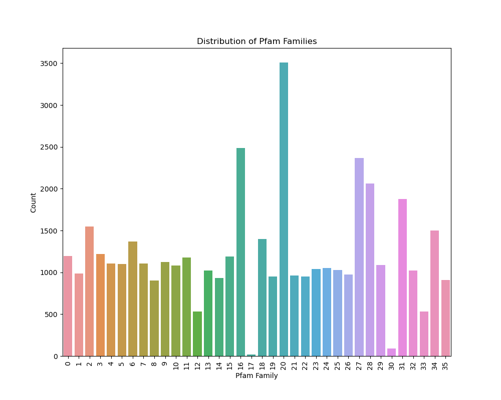

# Pfam Classification using a Transformer and Protein Sequences

This project aims to classify protein sequences into their respective Pfam families using a Transformer model. The project consists of several steps, including data preprocessing, model architecture, training, and evaluation. I wanted to perform this project after reading an article of Nambiar et al. (2020) called "Transforming the Language of Life: Transformer Neural Networks for Protein Prediction Tasks" and a M2 report by Aliouane and Bendahmane named "Nouvelle approche de prédiction des classes protéiques issues d’un séquençage NGS par Deep Learning".

I wanted to perform this project using my own database hence I downloaded a dataset from InterPro. This dataset contained multiple sequence alignments of a significant amount of protein domains.

Link to download original dataset:

https://www.ebi.ac.uk/interpro/download/pfam/

The file is Pfam-A Seed alignment : "Pfam-A.seed.gz"

**I am currently working on the model architecture and the training script, they are not finished!**

---

## Data Extraction and Preprocessing

The data preprocessing step involves loading the data from the `Pfam-A.seed.gz` file.
Using REGEX, I identified that :
* This file contained 1,198,004 sequences among 19996 families.
* 36 families contained more than 900 sequences. I extracted them to a CSV file. All of this was done in the `data-extraction.py` file.

I plotted a countplot of the different families in the following figure. Each x-label corresponds to one category.


We can observe that at some point the condition to extract the wanted families failed as we can see 4 families with less than 900 sequences.
After preprocessing of those families, here is the final distribution.


## Tokenization of our sequences

I then want to identify the frequent amino acids combination among the sequences. Those combinations can be seen as words forming a sentence (the sequence).
This identification is done by tokenizing our sequences.
I chose to use the SentencePiece Python library

All sequences in the `filtered_families.csv` file were processed to remove the '.' characters corresponding to the different indels between sequences.
They were then collected together in the `sequences.txt` file which allowed me to train the tokenizer model. It recognized the 5000 most frequent 'subwords' among sequences.
The trained model and its vocabulary are respectively saved in the `amino_acids.model` and the `amino_acids.vocab` files.

Here is an example of the tokenization of the following test sequence:

>sequence_test = 'MTEYKLVVVGAGGVGKSALTIQLIQNHFVDEYDPTIEDSYRKQVVIDGETCLLDILDTAGQEEYSAMRDQYMRTGEGFLCVFAINNTKSFEDIHQYREQIKRVKDSDDVPMVLVGNKCDLAARTVESRQAQDLARSYGIPYIETSAKTRQGVEDAFYTLVREIRQHKLRKLNPPDESGPGCMNCKCVIS'

``tokens = sp.EncodeAsPieces(sequence_test)``

``print(tokens)``

 `['▁M', 'T', 'EY', 'KL', 'VV', 'VGA', 'GG', 'VG', 'K', 'SAL', 'TI', 'QL', 'IQN', 'HF', 'VDE', 'YD', 'PT', 'IED', 'S', 'YRK', 'QVV', 'ID', 'GET', 'CL', 'LDI', 'LDTA', 'GQ', 'EEY', 'SA', 'MRD', 'QY', 'MR', 'TG', 'EGF', 'LC', 'VFA', 'IN', 'NT', 'KSF', 'EDI', 'HQ', 'YR', 'EQI', 'KRV', 'KD', 'SD', 'DVP', 'MV', 'LVG', 'NK', 'CD', 'LAA', 'RT', 'VES', 'RQ', 'AQ', 'DLA', 'RSY', 'GIP', 'YIE', 'TS', 'AK', 'TR', 'QG', 'VED', 'A', 'FY', 'TLV', 'REIR', 'Q', 'HKL', 'RK', 'LNP', 'PDE', 'S', 'GPG', 'CM', 'NC', 'KC', 'VIS']`
 
## Model Architecture

The model architecture consists of a Transformer model with the following components:

* Token and position embedding layers
* Multiple Transformer blocks, each consisting of a multi-head attention layer, a feed-forward network, and layer normalization
* A global average pooling layer
* An output layer with a softmax activation function

The model is implemented using TensorFlow and the Keras API.

The model architecture corresponds to this table:


| Layer (type) | Output Shape | Param # |
| ---: | ----: | ---: |
|input_layer (InputLayer)|(None, 128)|0|
|token_and_position_embedding|(None, 128, 64)|328,192|
|transformer_block (TransformerBlock)|(None, 128, 64)|166,016|
|transformer_block_1 (TransformerBlock)|(None, 128, 64)|166,016|
|transformer_block_2 (TransformerBlock)|(None, 128, 64)|166,016|
|transformer_block_3 (TransformerBlock)|(None, 128, 64)|166,016|
|global_average_pooling1d|(None, 64)|0|
|dense_8 (Dense)|(None, 32)|2,080|

 Total params: 994,336 (3.79 MB)
 Trainable params: 994,336 (3.79 MB)
 Non-trainable params: 0 (0.00 B)


## Training

The training step involves using the preprocessed data to train the Transformer model. The data is loaded from a CSV file, and the family names are encoded using LabelEncoder. The sequences are then tokenized using the SentencePiece tokenizer, and padded to a fixed length. The data is split into training and validation sets, and the model is compiled with sparse categorical cross-entropy loss and the Adam optimizer.

The model is trained for a specified number of epochs, with a batch size and learning rate set to 32 and 0.0001, respectively. After training, the trained model's weights are saved to a file. In this case, the model is trained for 5 epochs, and the weights are saved to a file named `pfam_transformer_trained_5epochs.weights.h5`.

## Evaluation

An empty model is pre-initialized and then loads the trained weights.
The evaluation step involves evaluating the performance of the trained model on the validation set and reporting the accuracy and loss metrics.


# Classification Report:

```
                                                                      precision    recall  f1-score   support

                                     Acetyltransferase (GNAT) domain       1.00      1.00      1.00      1196
                     AIR synthase related protein, N-terminal domain       1.00      0.99      0.99       988
                                                      Ankyrin repeat       0.98      0.98      0.98      1546
                                           tRNA synthetase B5 domain       0.98      0.93      0.95      1218
                                         Bacterial sugar transferase       1.00      1.00      1.00      1108
                                                Chromate transporter       0.98      0.99      0.99      1099
                                                          DHH family       1.00      1.00      1.00      1366
                                                 DnaJ central domain       1.00      1.00      1.00      1105
         6-O-methylguanine DNA methyltransferase, DNA binding domain       1.00      0.99      0.99       901
                                            GAG-pre-integrase domain       1.00      1.00      1.00      1125
                  Glycosyl transferase family, helical bundle domain       1.00      0.99      0.99      1082
                                                         Ham1 family       0.98      0.99      0.98      1179
                                                    Histidine kinase       0.97      0.99      0.98      1024
          Bacterial regulatory helix-turn-helix protein, lysR family       1.00      0.99      0.99       934
                               GDSL-like Lipase/Acylhydrolase family       0.99      0.99      0.99      1190
                                                 Leucine Rich Repeat       0.99      1.00      0.99      2487
                                             Lumazine binding domain       1.00      0.99      1.00      1401
                                                    Maf-like protein       1.00      0.98      0.99       950
                                            Methyltransferase domain       0.99      0.99      0.99      3506
                            MoeA N-terminal region (domain I and II)       0.99      0.99      0.99       964
                                                     MutS domain III       0.98      0.99      0.99       950
Aspartate/ornithine carbamoyltransferase, carbamoyl-P binding domain       1.00      0.99      0.99      1038
                                 PEP-utilising enzyme, mobile domain       0.95      0.98      0.96      1054
                          Putative undecaprenyl diphosphate synthase       0.98      0.99      0.99      1026
                                   Pumilio-family RNA binding repeat       0.95      0.99      0.97       977
                                      RecX, first three-helix domain       0.99      1.00      0.99      2366
                                     RecX, second three-helix domain       0.99      0.99      0.99      2060
                                      RecX, third three-helix domain       0.97      0.98      0.98      1086
                           SRP54-type protein, helical bundle domain       0.98      0.99      0.99      1879
                 Terpene synthase family 2, C-terminal metal binding       1.00      1.00      1.00      1021
     Tetrahydrofolate dehydrogenase/cyclohydrolase, catalytic domain       0.99      0.95      0.97      1502
                                            WD domain, G-beta repeat       0.97      0.99      0.98       910
                                            
                                                            accuracy                           0.99     42238
                                                           macro avg       0.99      0.99      0.99     42238
                                                        weighted avg       0.99      0.99      0.99     42238
```


Here is a draft of the confusion matrix: (I am working on it to be more clear)


## Usage

To use this project, you will need to install the following dependencies:

* TensorFlow
* Keras
* NumPy
* Pandas
* Seaborn
* Scikit-learn
* SentencePiece


The filtered CSV file is already uploaded to the repository. You can either directly use it or download the original dataset and perform the extraction using `data-extraction.py`. You will have to manually modify the path of your file.

You can then run the `data_preprocessing.py` script to preprocess the data,

the `model_architecture.py` script to define the model architecture, and the `training.py` script to train the model. The trained model will be saved to a file, which can be used to make predictions on new data.

## Results

## Future Work


